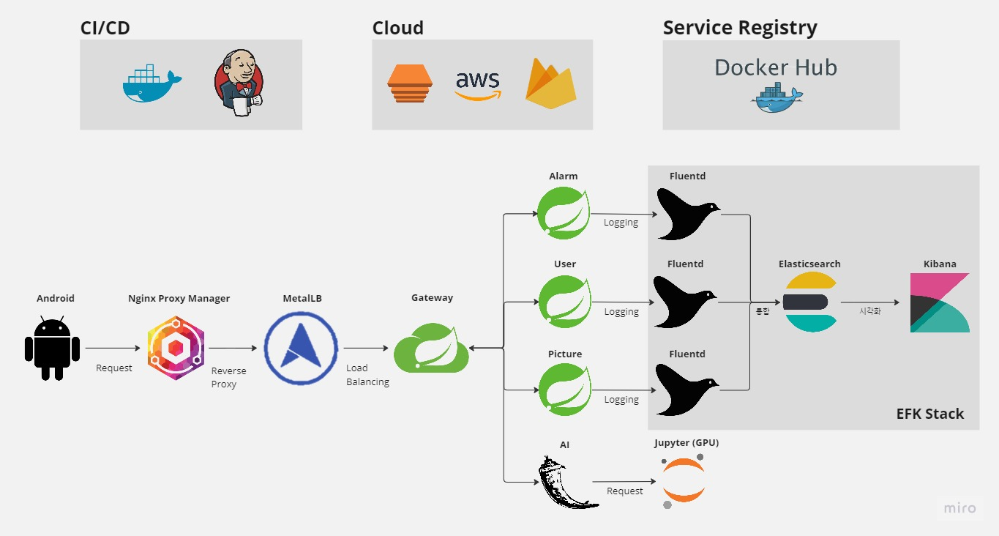

# k8s 가이드 v1.0 (2023-05 ~)

lasted updated : 2024. 9. 10.

##### CreAIte 프로젝트 인프라를 구축하고, 공유 및 참고를 위해 작성한 가이드입니다.
##### 프로젝트 종료 이후에 작성하여 생략된 부분이 있을 수 있으니, 참고바랍니다.
##### (2024. 9. 10 ~ ) 최신화 및 누락된 부분 업데이트 시작

---

# 아키텍처

### 아키텍처 구성



---

### 클러스터 구성


---

### 파이프라인 구성


## 인프라 구축 환경 및 목표


**EC2 인스턴스를 2개 사용하는 상황**에서 마스터 노드와 워커 노드를 각각 하나씩 운영하기 때문에, 가용성을 완벽하게 확보하기 어려운 상황.

가용성을 향상시키려면 일반적으로 여러 워커 노드를 사용하여 애플리케이션을 분산시키고, 노드 간에 리소스를 조정해야함.

**현 상황에 상대적인 가용성을 높이려면, 다음과 같은 방안을 고려할 수 있음.**
```
1. 복제본 사용: 쿠버네티스에서 제공하는 복제본(replicas) 기능을 활용하여 워커 노드 내에서 각 애플리케이션의 인스턴스를 여러 개 실행시킵니다. 이를 통해 애플리케이션 인스턴스 중 하나에 문제가 발생하더라도, 다른 인스턴스를 통해 서비스를 계속 제공할 수 있습니다.
2. 자동 복구 설정: 쿠버네티스의 livenessProbe와 readinessProbe를 설정하여, 애플리케이션의 상태를 감지하고 필요한 경우에 자동으로 인스턴스를 재시작하거나 대체할 수 있습니다. 이를 통해 애플리케이션의 문제가 발생했을 때 빠르게 대응할 수 있습니다.
3. 롤링 업데이트: 애플리케이션 업데이트 시, 쿠버네티스의 롤링 업데이트 기능을 활용하여 서비스 중단 없이 순차적으로 인스턴스를 업데이트할 수 있습니다. 이 방법은 가용성을 유지하면서 애플리케이션 업데이트를 수행할 수 있게 합니다.
4. 리소스 제한 및 할당: 네임스페이스를 사용하여 각 애플리케이션별로 리소스 제한을 설정하고, 전체 시스템의 리소스 사용을 관리할 수 있습니다. 이를 통해 한 애플리케이션의 리소스 사용이 다른 애플리케이션에 영향을 주지 않도록 제한할 수 있습니다.
5. 모니터링 및 로깅: 애플리케이션 및 인프라의 모니터링과 로깅을 설정하여, 시스템 상태를 실시간으로 확인하고 문제 발생 시 즉시 대응할 수 있도록 합니다. 이를 통해 가용성을 지속적으로 관리하고 개선할 수 있습니다.
```
**위 방안 중 (1)복제본 사용, (3)롤링 업데이트, (4)리소스 제한 및 할당, (5)EFK Stack 를 프로젝트에 최종적으로 적용** 

```
💡 본문에서는 앞으로 사용 중인 2개의 인스턴스를 다음과 같이 칭하겠습니다.
- 마스터 노드 EC2 인스턴스 → EC2 #1  
- 워커 노드 EC2 인스턴스 → EC2 #2 
```

## 환경 구성


**kubernetes를 설치하기 위해 다음 과정을 진행한다.**

- Docker설치
- Kubernetes 설치

다음 github에 있는 Shell Script를 활용 하겠다.

**sandervanvugt/cka**

**master, node1, node2 모두**에 동일하게 git clone을 진행해 주자.

```bash
ubuntu@master:~$ git clone https://github.com/sandervanvugt/cka.git
Cloning into 'cka'...
remote: Enumerating objects: 185,done.
remote: Counting objects: 100% (93/93),done.
remote: Compressing objects: 100% (64/64),done.
remote: Total 185 (delta 43), reused 35 (delta 29), pack-reused 92
Receiving objects: 100% (185/185), 344.62 KiB | 2.73 MiB/s,done.
Resolving deltas: 100% (75/75),done.
```

역시 **master,node1,node2 모두** 아래 명령어를 실행 시켜 준다.

```bash
~/cka$ ./setup-container.sh

~/cka$ sudo ./setup-kubetools.sh
```

이제 Docker와 Kubernetes가 다 설치 완료 되었다.

## Kubernetes 클러스터 생성


**마스터 노드**에 Control plane을 만들어 주자.

```bash
ubuntu@master:~/cka$ sudo kubeadm init
```

성공적으로 설치가 완료 되었다면 아래 명령어를 마스터 노드에서만 실행시켜준다.

```bash
mkdir -p $HOME/.kube
sudo cp -i /etc/kubernetes/admin.conf $HOME/.kube/config
sudo chown $(id -u):$(id -g) $HOME/.kube/config
```

위 명령어를 적용했다면 Control Plane 설치가 완료 되었으므로 사용 할 Node 들을 등록해야 한다.

**Node1, Node2**에서는 아래 명령어를 실행해 준다.

```bash
sudo kubeadm join 10.112.125.79:6443 --token 9l0e6o.qj4woevjzw2d6323 \
--discovery-token-ca-cert-hash sha256:d726f1abcd3601d00a0146fe7d2a78cafcf732d16e76f39a6117495e75987828bash
```

위 명령어의 토큰은 Control Plane의 설치 완료 후에 나오는 토큰 값이다.


Node 3개가 나오면 Kubernetes 설치를 완료 한 것이다.


## Kubernetes cluster - Network Plugin 설치

위에서 보면 get nodes의 결과에 Status가 NotReady인것을 확인 할 수있다.

NotReady가 발생하는 이유는 네트워크를 설치하지 않았기 때문이다.

참고: [https://kubernetes.io/docs/concepts/cluster-administration/networking/](https://kubernetes.io/docs/concepts/cluster-administration/networking/)

cluster network를 구성하기 위해 plugin을 설치해 줘야 한다.

여기서는 weave 를 설치하겠다.

```bash
$ kubectl apply -f https://github.com/weaveworks/weave/releases/download/v2.8.1/weave-daemonset-k8s.yamlbash
```

위와 같이 weave를 설치한 후 Status가 모두 Running 및 Ready 상태가 된 것을 확인 할 수 있다.


아래는 위 과정을 거쳐 구축한 클러스터다.

모든 노드가 Ready 상태인걸 확인할 수 있다.


**이제 클러스터 구성이 완료되었다.**

## 클러스터 외부 요소 배포 - Docker


**Docker 설치 (생략)**

### 마스터 노드(EC2 #1) 도커에 MariaDB 배포

- MariaDB를 배포하기 위한 docker-compose를 수행할 위치에, 다음 파일들을 생성한다.

**[.env]**

```jsx
MARIADB_ROOT_PASSWORD=root password
MARIADB_DATABASE=schema name
MARIADB_USER=user name
MARIADB_PASSWORD=password
```

**[docker-compose.yaml]**

```jsx
version: "3.3"
services:
        db-prod:
                container_name: "db"
                command: ["--max_connections=1024"]
                image: mariadb:10
                ports:
                        - 3406:3306
                volumes:
                        - ./db/conf.d:/etc/mysql/conf.d
                        - ./db/data:/var/lib/mysql
                        - ./db/initdb.d:/docker-entrypoint-initdb.d
                env_file: .env
                environment:
                        TZ: Asia/Seoul
                restart: always
```

- 위 volumes의 **‘./db/conf.d’ , ‘./db/data’ , ‘./db/initdb.d’** 디렉토리 생성
- **디렉토리 구조 (예시)**
    - ~
        - mariaDB
            - docker-compose.yaml
            - .env
            - db/
                - conf.d/
                - data/
                - initdb.d/

### 워커 노드(EC2 #2) 도커에 Nginx Proxy Manager 배포

**[docker-compose.yaml]**

```jsx
version: '3.3'
services:
  app:
    image: 'jc21/nginx-proxy-manager:latest'
    restart: unless-stopped
    ports:
      # These ports are in format <host-port>:<container-port>
      - '80:80' # Public HTTP Port
      - '443:443' # Public HTTPS Port
      - '8081:81' # Admin Web Port
      # Add any other Stream port you want to expose
      # - '21:21' # FTP
    environment:
      # Mysql/Maria connection parameters:
      DB_MYSQL_HOST: "db"
      DB_MYSQL_PORT: 3306
      DB_MYSQL_USER: "npm"
      DB_MYSQL_PASSWORD: "npm"
      DB_MYSQL_NAME: "npm"
      # Uncomment this if IPv6 is not enabled on your host
      # DISABLE_IPV6: 'true'
    volumes:
      - ./data:/data
      - ./letsencrypt:/etc/letsencrypt
    depends_on:
      - db

  db:
    image: 'jc21/mariadb-aria:latest'
    restart: unless-stopped
    environment:
      MYSQL_ROOT_PASSWORD: 'npm'
      MYSQL_DATABASE: 'npm'
      MYSQL_USER: 'npm'
      MYSQL_PASSWORD: 'npm'
    volumes:
      - ./mysql:/var/lib/mysql
```

## 클러스터 내부 - Storage Class


### Storage Class

[Storage Class 란? (공식 Docs)](https://kubernetes.io/ko/docs/concepts/storage/storage-classes/) 

PV/PVC를 사용하기 위해 Storage Class 정의한다.

**[aws-ebs-sc.yaml]**

```jsx
apiVersion: storage.k8s.io/v1
kind: StorageClass
metadata:
  name: aws-ebs-sc
provisioner: kubernetes.io/aws-ebs
parameters:
  type: gp2
  fsType: ext4
```

**$ kubectl get storageclass**


## 클러스터 내부 - Jenkins

**[jenkins-pv-dev.yaml]**

```jsx
apiVersion: v1
kind: PersistentVolume
metadata:
  name: jenkins-pv-volume
  labels:
    name: jenkins
spec:
  capacity:
    storage: 10Gi
  accessModes:
    - ReadWriteOnce
  persistentVolumeReclaimPolicy: Retain
  storageClassName: aws-ebs-sc
  hostPath:
    path: "/data/jenkins"
```

**$ kubectl get pv**


**[jenkins-pvc-dev.yaml]**

```jsx
apiVersion: v1
kind: PersistentVolumeClaim
metadata:
  name: jenkins-pv-claim
spec:
  storageClassName: aws-ebs-sc
  accessModes:
    - ReadWriteOnce
  resources:
    requests:
      storage: 10Gi
```

**$ kubectl get pvc**


**[jenkins-service-dev.yaml]**

```jsx
apiVersion: v1
kind: Service
metadata:
  name: jenkins-svc-dev
  namespace: dev
  labels:
    app: jenkins
spec:
  ports:
    - port: 8080
      name: http
      targetPort: 8080
    - port: 50000
      name: slave
      targetPort: 50000
  selector:
    app: jenkins
  type: LoadBalancer
```

**$ kubectl get service**


<aside>
💡 위 이미지의 EXTERNAL-IP는 MetalLB를 통해 할당한 사설 외부 IP이다.

</aside>

**[jenkins-statefulset-dev.yaml]**

```jsx
apiVersion: apps/v1
kind: StatefulSet
metadata:
  name: jenkins-dev
  namespace: dev
spec:
  serviceName: "jenkins-dev"
  replicas: 1
  selector:
    matchLabels:
      app: jenkins
  template:
    metadata:
      labels:
        app: jenkins
    spec:
      securityContext:
        runAsUser: 0
      containers:
        - name: jenkins
          image: jenkins/jenkins:lts-jdk11
          env:
            - name: JAVA_OPTS
              value: -Djenkins.install.runSetupWizard=true -Xms256m -Xmx512m
          ports:
            - containerPort: 8080
          volumeMounts:
            - mountPath: /var/jenkins_home
              name: jenkins-persistent-storage
            - name: kubeconfig
              mountPath: /var/lib/jenkins/.kube
              readOnly: true
      volumes:
        - name: jenkins-persistent-storage
          persistentVolumeClaim:
            claimName: jenkins-pv-claim
        - name: kubeconfig
          configMap:
            name: kubeconfig
```

**$ kubectl get statefulset**


## 클러스터 내부 - MetalLB


### MetalLB 설치

```bash
kubectl apply -f https://raw.githubusercontent.com/metallb/metallb/v0.11.0/manifests/namespace.yaml
kubectl apply -f https://raw.githubusercontent.com/metallb/metallb/v0.11.0/manifests/metallb.yaml
```

### Secret 생성

```bash
kubectl create secret generic -n metallb-system memberlist --from-literal=secretkey="$(openssl rand -base64 128)"
```

### **ConfigMap 생성**

**[metallb-config.yaml]**

```jsx
apiVersion: v1
kind: ConfigMap
metadata:
  namespace: metallb-system
  name: config
data:
  config: |
    address-pools:
    - name: default
      protocol: layer2
      addresses:
      - 192.168.56.100-192.168.56.200
```

- 192.168.56.100-192.168.56.200
    - MetalLB가 할당하게 할 사설 IP 주소의 범위 설정

### ConfigMap 적용

```bash
kubectl apply -f metallb-config.yaml
```

<aside>
💡 kubectl get service 입력 시 나오는 서비스 목록에는 External-IP가 할당 되어야 한다.


</aside>

### Cloudflare DNS 설정

**Nginx Proxy Manager, Cloudflare 활용**

Nginx Proxy Manager의 SSL 발급 및 설정에서 와일드카드(*)를 사용하기 위해 Cloudflare를 사용 (가비아에서는 NPM 와일드카드 사용 불가)

도메인 : hexa-backenders.com


- 편의상 와일드카드(*)로 CNAME 설정
- *.hexa-backenders.com 로 들어온 요청은 DNS 설정으로 인해, 워커 노드로 사용중인 EC2 #2로 들어가게 된다.

### Nginx Proxy Manager 설정

SSL 발급 시 ‘Use a DNS Challenge’ → Cloudflare API token 입력해 와일드카드 SSL 발급


클러스터 내부에서 실행중인 Service External-IP를 Destination으로 리버스 프록시 설정


<aside>
💡 이제, https://[dev-gateway.hexa-backenders.com](http://dev-gateway.hexa-backenders.com), [https://dev-jenkins.hexa-backenders.com](https://dev-jenkins.hexa-backenders.com) 으로 접속 시
클러스터 내 gateway 서비스에 접근이 가능해야 한다.

</aside>

## 클러스터 내부 - Spring Cloud Gateway


**[gateway/application.yaml]**

```bash
server:
  port: 8080

logging:
  level:
    root:
      DEBUG

spring:
  cloud:
    gateway:
      routes:
        # dev
        - id: user-dev
          uri: http://user-dev.dev.svc.cluster.local:8080 # 쿠버네티스 서비스의 FQDN
          predicates:
            - Path=/user/**

        - id: picture-dev
          uri: http://picture-dev.dev.svc.cluster.local:8080 # 쿠버네티스 서비스의 FQDN
          predicates:
            - Path=/picture/**

        - id: alarm-dev
          uri: http://alarm-dev.dev.svc.cluster.local:8080 # 쿠버네티스 서비스의 FQDN
          predicates:
            - Path=/alarm/**

        - id: flask1
          uri: http://175.209.203.185:5000 # GPU 서버
          predicates:
            - Path=/flask1/**

        - id: flask2
          uri: http://175.209.203.185:5001 # GPU 서버
          predicates:
            - Path=/flask2/**

        - id: flask3
          uri: http://175.209.203.185:5002 # GPU 서버
          predicates:
            - Path=/flask3/**

              
  profiles:
    active: dev
```

<aside>
💡 이제 Spring Cloud Gateway를 통한 라우팅이 완료됐다. 
따라서, “https://dev-gateway.hexa-backenders.com/user/경로” 와 같은 경로를 통해, 클러스터 내부에 접근할 수 있게 되었다.

</aside>

## Jenkins Pipeline CI/CD

### 플러그인 설치

1. GitHub plugin
2. Pipeline
3. Docker Pipeline
4. Kubernetes plugin
5. Git plugin

<aside>
💡 플러그인 설치가 한 번에 안되고, 계속 설치가 실패하는 상황이 발생했었다.

계속 안된다면 [젠킨스 플러그인목록](http://updates.jenkins-ci.org/download/plugins/)에서 직접 다운 받아서 설치하자.

</aside>

### Jenkins Kubernete 설정

**Jenkins 관리 → Nodes → Configure Clouds**


**Kubernetes URL**

$ kubectl cluster-info


출력되는 URL을 입력한다.

(내 클러스터의 경우에는https://172.26.11.93:6443)

**Kubernetes Namespace** 

사용 중인 Namespace 명 입력한다.

**Credentials**

Jenkins 관리 → Credentials에서 Secret file 타입으로 kubeconfig file을 등록하고, 등록한 Credential을 선택한다.

**Jenkins tunnel**

클러스터 내부에서 에이전트와 마스터 간의 통신이 발생하므로, 

클러스터 내부의 IP 주소를 사용해야 한다. 

따라서 Jenkins 터널 주소를 클러스터 IP(10.107.105.253)로 설정하고, 50000 포트로 지정한다.

<aside>
⚠️ Jenkins tunnel 주소에 어떤 주소를 입력해야 하는지 알기 위해 많은 시간을 소모하였다.

**”agent is offline” 오류**

처음에는, MetalLB를 통해 할당한 사설 External-IP인 192.168.56.104:50000로 Jenkins tunnel을 설정했지만, 뒤늦게 나는 Jenkins agent와 master사이의 연결은 클러스터 내부에서 일어나고 있다는 사실을 깨닫게 되었다. 

즉, 클러스터 내 Jenkins Service에서, Jenkins agent와 master의 통신이 발생하고 있기 때문에, **Jenkins Service의 Cluster-IP**를 입력해야 했다.

</aside>

### Dockerfile 작성

**[gateway/Dockerfile]**

```bash
FROM adoptopenjdk/openjdk11 AS builder
COPY gradlew .
COPY gradle gradle
COPY build.gradle .
COPY settings.gradle .
COPY src src
RUN chmod +x ./gradlew
RUN ./gradlew bootJAR

FROM adoptopenjdk/openjdk11
COPY --from=builder build/libs/*.jar app.jar
EXPOSE 8080
ENTRYPOINT ["java", "-jar", "/app.jar"]
```

### Deployment, Service yaml 작성

**[gateway/gateway-deployment.yaml]**

- replicas를 2로 설정하고, RollingUpdate 전략을 사용해 무중단 배포를 구현한다.

```bash
apiVersion: apps/v1
kind: Deployment
metadata:
  name: gateway-dev
  namespace: dev
spec:
  replicas: 2
  selector:
    matchLabels:
      app: gateway
  strategy:
    type: RollingUpdate
    rollingUpdate:
      maxSurge: 1
      maxUnavailable: 0
  template:
    metadata:
      labels:
        app: gateway
    spec:
      containers:
        - name: gateway
          image: ${DOCKER_IMAGE_TAG}
          ports:
            - containerPort: 8080
          env:
            - name: SPRING_PROFILES_ACTIVE
              value: dev
          resources:
            limits:
              cpu: 500m
              memory: 512Mi
            requests:
              cpu: 250m
              memory: 256Mi
      imagePullSecrets:
        - name: dockerhub-secret
```

<aside>
💡 먼저, dockerhub-secret 이라는 Kubernetes Secret을 등록(apply)해야 한다.
아래 파이프라인에서 사용하기 위해서이며, private Docker Hub 저장소에 접근하기 위해서이다. 
이는 비밀 파일로, Github에 업로드 해서는 안되며, 마스터 노드에서 직접 작성해서 kubectl apply 하도록 하자.

</aside>

**[dockerhub-secret.yaml]**

```bash
apiVersion: v1
kind: Secret
metadata:
  name: dockerhub-secret
  namespace: **네임스페이스 입력**
type: kubernetes.io/dockerconfigjson
stringData:
  .dockerconfigjson: |-
    {
      "auths": {
        "https://index.docker.io/v1/": {
          "username": **"DOCKER HUB USERNAME"**,
          "password": **"DOCKER HUB PASSWORD"**,
          "email": **"이메일"**,
          "auth": ""
        }
      }
    }
```

**[gateway/gateway-service.yaml]**

```bash
apiVersion: v1
kind: Service
metadata:
  name: gateway-dev
  namespace: dev
spec:
  selector:
    app: gateway
  ports:
    - protocol: TCP
      port: 80
      targetPort: 8080
  type: LoadBalancer
```

### Jenkinsfile (Pipeline) 작성

<aside>
💡 해당 파이프라인을 사용하려면 다음 ID를 가진 Credential이 Jenkins에 정의되어 있어야 한다.
- docker-hub-credentials : Docker hub 계정 정보
- kubeconfig : kubeconfig Secret File

예시로 든 Gateway 저장소의 루트 디렉토리의 구성은 다음과 같다.


</aside>

[**gateway/Jenkinsfile]**

- Jenkinsfile에서는 Jenkins-agent라는 파드를 생성한다.
- Jenkins-agent Pod는 는 jnlp, docker, kubectl 컨테이너로 구성되어 있으며, 내가 원하는 작업을 수행하는 역할을 한다.

<aside>
⚠️ Jenkinsfile을 작성하고, Pipeline을 정상 동작시키는데에, 많은 노력을 기했다. 특히, kubectl 컨테이너에서 sh 명령어가 동작하지 않는 부분에 가장 큰 시간을 소모했는데,  'securityContext: runAsUser: 0’ 옵션으로 권한을 부여하여 해결했다. 

하지만, 이런 방식으로 무작정 모든 권한을 부여하는 것은 좋지 않은 것 같다. 
프로젝트 진행을 위해 그냥 넘어갔지만, 다음 번엔 정확히 알고 사용해야 할 것 같다.

</aside>

```bash
pipeline {
    agent {
        kubernetes {
            label 'kubernetes-agent'
            defaultContainer 'jnlp'
            yaml """
apiVersion: v1
kind: Pod
metadata:
  labels:
    app: jenkins-agent
spec:
  containers:
  - name: jnlp
    image: jenkins/inbound-agent:latest
    args: ['\$(JENKINS_SECRET)', '\$(JENKINS_NAME)']
    volumeMounts:
      - mountPath: /var/jenkins_home
        name: workspace-volume
  - name: docker
    image: docker:latest
    command:
    - cat
    tty: true
    volumeMounts:
      - name: docker-socket
        mountPath: /var/run/docker.sock
  - name: kubectl
    image: bitnami/kubectl:latest
    command:
    - cat
    tty: true
    workingDir: '/home/jenkins/agent'
    securityContext:
      runAsUser: 0
    env:
    - name: BUILD_NUMBER
      value: "${env.BUILD_NUMBER}"
  volumes:
  - name: docker-socket
    hostPath:
      path: /var/run/docker.sock
  - name: workspace-volume
    emptyDir: {}
"""
        }
    }

    stages {
        stage('Docker build and push') {
            steps {
                container('docker') {
                    script {
                        // Git 설치
                        sh 'apk add --no-cache git'

                        sh 'git config --global --add safe.directory /home/jenkins/agent/workspace/gateway'

                        // Git commit 해시 가져오기
                        def gitCommitHash = sh(returnStdout: true, script: 'git rev-parse --short HEAD').trim()

                        // Docker 이미지 빌드 및 푸시
                        sh "docker build -t sungwookoo/gateway:develop-${gitCommitHash} ."
                        withCredentials([usernamePassword(credentialsId: 'docker-hub-credentials', usernameVariable: 'DOCKER_HUB_USERNAME', passwordVariable: 'DOCKER_HUB_PASSWORD')]) {
                            sh 'docker login -u $DOCKER_HUB_USERNAME -p $DOCKER_HUB_PASSWORD'
                            sh "docker push sungwookoo/gateway:develop-${gitCommitHash}"
                        }
                        env.DOCKER_IMAGE_TAG = "sungwookoo/gateway:develop-${gitCommitHash}"
                    }
                }
            }
        }

        stage('Deploy to Kubernetes') {
            steps {
                container('kubectl') {
                    script {
                        withCredentials([file(credentialsId: 'kubeconfig', variable: 'KUBECONFIG')]) {
                            sh 'apt-get update' // 패키지 목록 업데이트
                            sh 'apt-get install -y gettext' // gettext 설치
                            sh "export DOCKER_IMAGE_TAG=${env.DOCKER_IMAGE_TAG} && envsubst < gateway-deployment-dev.yaml > temp-deployment.yaml"
                            sh 'kubectl apply -f temp-deployment.yaml -n dev --kubeconfig=$KUBECONFIG'
                            sh 'kubectl apply -f gateway-service-dev.yaml -n dev --kubeconfig=$KUBECONFIG'
                            sh 'rm temp-deployment.yaml' // 임시 파일 삭제
                        }
                    }
                }
            }
        }
    }
}
```

<aside>
💡 Github Webhook을 통한 파이프라인 작업은, 특정 조치를 취해야 한다.
(이 부분을 알지 못해 상당한 시간을 소모했었다.)

특정 조치는 다음과 같다.
- 빌드 트리거로 Github Push 감지하고 Pipeline Job을 실행한다.

즉, 2개의 Job을 생성해야 한다. (1개는 감지용, 1개는 파이프라인 실행용)

</aside>

### Pipeline Job 생성

- Pipeline으로 Job 생성
- 구성


- **Pipeline script from SCM으로 Definition 설정**
- **SCM → Git 선택**
- **Jenkinsfile을 가져올 Github 저장소 지정**
- **Github Credentials 선택**
- **가져올 Branch 선택**


- **Jenkinsfile의 위치 지정 → 루트라면 Jenkinsfile**

### Build Trigger Job 생성

- **Freestyle project로 Job 생성**
- **구성**


- **저장소 지정**
- **Credentials 설정**
- **Branch 지정**


- **GitHub hook trigger for GITScm polling 체크**
- **빌드 후 조치 → Build other projects에 생성한 Pipeline Job 입력**
